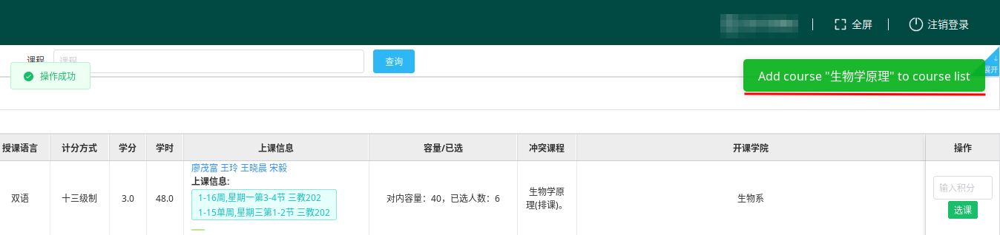
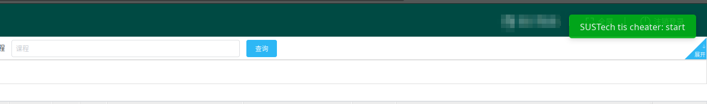
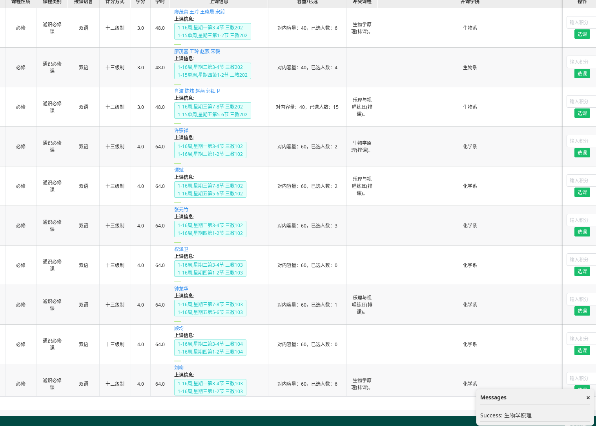
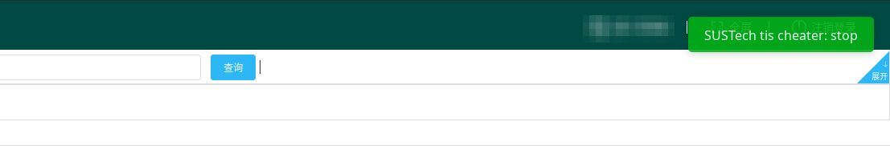
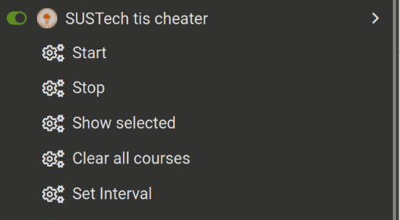

# TIS helper

> 截至2024-9-9，本脚本可用

## 安装

请使用 Tampermonkey 脚本管理器，建议从 [官网](https://www.tampermonkey.net/)
安装。安装完成后，[点击此处安装脚本](https://raw.githubusercontent.com/vollate/SUSTech-tis-cheater/main/tis-cheater.user.js)。

## 用法

- 选择待抢课程：手动选择你要抢的课，点选课来添加课程到待抢名单（非选课时间段会自动激活被禁用的按钮）。添加成功后右上角会有提示，这个课程存在本地，关闭页面仍然保留。
  
    
- 开始抢课：点击浏览器插件 Tampermonkey 的图标，在 `SUSTech tis cheater`选项栏中点击 `Start` 按钮开始抢课。开始后右上角会显示通知。
  
    
- 抢课成功：当抢课成功时，右下角的窗口会显示对应课程信息。
  
    
- 想要停止时，点击 `Stop` 按钮。停止后会发送通知。
  
- 设置抢课时间间隔和其他功能参考下方的[选项栏功能介绍](#选项栏功能介绍)。

> **注意**：
> 1. 本脚本只在域名 `tis.sustech.edu.cn` 上工作，如需抢课，请在 tis 页面上进行操作。
> 2. 由于需要注入页面，加载时间会有所延长，如有问题请刷新页面重试。

## 选项栏功能介绍

- Start: 开始抢课，结束前请不要关闭当前标签或切换到别的标签，保持浏览器标签处于激活状态。否则脚本可能被浏览器暂停执行。
- Stop: 停止抢课
- Show selected：显示待抢课列表
- Clear all courses: 清空待抢课列表
- Set interval: 设置单次请求的抢课时间间隔，单位为毫秒，默认值为 200。抢课逻辑为循环请求待抢列表内的课程。

> **注意**：自 2024 年秋季学期开始，学校对抢课频率进行了限制，最小请求间隔约为 1.5s。考虑到网络延迟等因素，建议将间隔设置为 1600ms 或以上。

## 免责声明

- 本脚本（以下简称“脚本”）仅供学习和研究目的，不得用于任何商业或非法活动。使用本脚本进行抢课等活动完全基于用户个人决定，与脚本作者无关。
- 用户在使用本脚本时应确保其行为符合当地法律法规及所在学校的规章制度。脚本作者不对用户使用脚本而可能违反的法律法规或校规负责。
- 使用本脚本可能带来的任何风险（包括但不限于帐号封禁、学校纪律处分等后果）由用户自行承担。脚本作者不承担因使用脚本而产生的任何直接或间接后果的责任。
- 脚本作者不对脚本的持续运作、更新、效果或任何相关服务提供任何形式的保证。脚本的效能可能受到众多因素的影响，包括但不限于网络环境、系统兼容性等。
- 对于本免责声明的解释或适用，脚本作者保留最终解释权。

## TODO

- [x] 显示添加到抢课列表中的课程名
- [x] 删除单个课程
- [x] 显示抢课成功消息
- [ ] 抢课成功后自动从待抢列表中删除
- [ ] 定时启动
